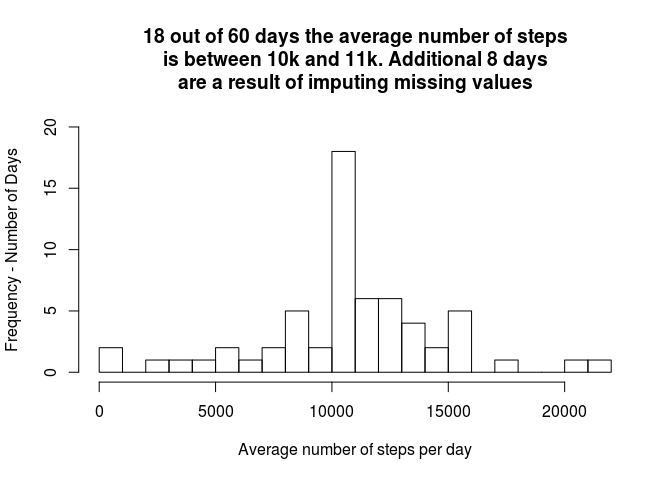
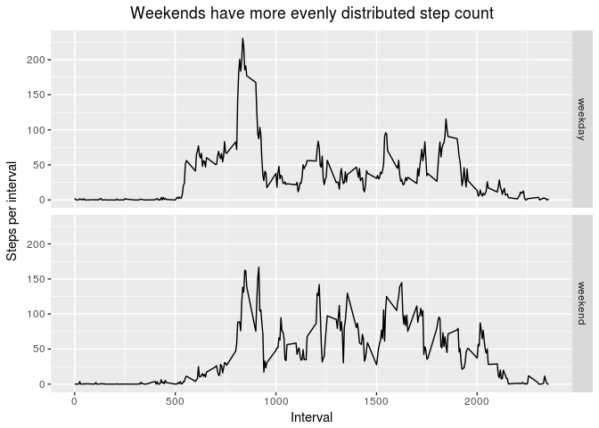

# Reproducible Research: Peer Assessment 1


## Loading and preprocessing the data

Below is the code for unzipping and reading in the dataset, as well as transforming the 'date' row into a Date format.

```r
steps <- read.csv(unz("activity.zip", "activity.csv"))
steps$date <- as.Date(steps$date)
```

## What is mean total number of steps taken per day?

The histogram shows the distribution of the total number of steps taken by the subject each day in the period of two months. The data shows that most days fall between 10000 and 11000 steps (exluding the days when measurments where not taken).

```r
library(dplyr)
```

```
## 
## Attaching package: 'dplyr'
```

```
## The following objects are masked from 'package:stats':
## 
##     filter, lag
```

```
## The following objects are masked from 'package:base':
## 
##     intersect, setdiff, setequal, union
```

```r
steps.by.date <- steps %>% 
                 group_by(date) %>% 
                 summarise(steps.per.day = sum(steps, na.rm = TRUE))
hist(steps.by.date$steps.per.day, breaks = 20)
```

<!-- -->


```r
mean.steps <- mean(steps.by.date$steps.per.day, na.rm = TRUE)
median.steps <- median(steps.by.date$steps.per.day, na.rm = TRUE)
```

Mean number of steps taken each day is 9354.2295082, while the median number of steps is 10395


## What is the average daily activity pattern?

```r
steps.by.interval <- steps %>% 
                     group_by(interval) %>% 
                     summarise(steps.per.interval = mean(steps, na.rm = TRUE))
with(steps.by.interval, plot(x = interval, y = steps.per.interval, type = 'l'))
```

<!-- -->

```r
steps.by.interval[which(steps.by.interval$steps.per.interval == max(steps.by.interval$steps.per.interval)),]
```

```
## # A tibble: 1 x 2
##   interval steps.per.interval
##      <int>              <dbl>
## 1      835           206.1698
```

## Imputing missing values

```r
sum(is.na(steps$steps))
```

```
## [1] 2304
```

```r
steps.noNA <- steps
for (i in seq(nrow(steps.noNA))){
    if (is.na(steps.noNA[i,1]))
        steps.noNA[i,1] <- as.integer(steps.by.interval[steps.by.interval$interval == steps.noNA[i,3], 2])
}
steps.noNA.by.date <- steps.noNA %>% 
                      group_by(date) %>% 
                      summarise(steps.per.day = sum(steps))
hist(steps.noNA.by.date$steps.per.day, breaks = 20)
```

<!-- -->

```r
mean(steps.noNA.by.date$steps.per.day)
```

```
## [1] 10749.77
```

```r
median(steps.noNA.by.date$steps.per.day)
```

```
## [1] 10641
```


## Are there differences in activity patterns between weekdays and weekends?

```r
library(ggplot2)
steps.noNA$day <- factor(rep("weekday", nrow(steps)), levels = c("weekday", "weekend"))
for (i in seq(nrow(steps.noNA))){
    if (weekdays(steps.noNA[i,2]) %in% c("Saturday", "Sunday"))
        steps.noNA[i,4] <- as.factor("weekend")
}
steps.by.interval.by.day <- steps.noNA %>% 
                            group_by(interval, day) %>% 
                            summarise(steps.per.interval = mean(steps))
g <- ggplot(steps.by.interval.by.day, aes(x = interval, y = steps.per.interval))
g + geom_line() + facet_grid(day~.)
```

<!-- -->


